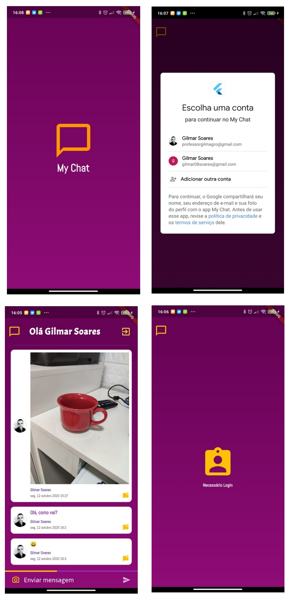

# Chat App

Chat de para tocas de mensagens em tempo real com banco de dados NoSQL Firebase. 

## Screenshots

## Recursos
- Login com o Google Account
- Atualização em tempo real
- Upload de imagens no FireStorage
- Segurança de banco (regras de acesso) 
- Autenticação no Firebase usando a conta Google
- Carregamento parcial (Stream) via scroll

## Stack

- google_fonts: any
- splashscreen: any
- cloud_firestore: ^0.13.0+1
- image_picker: ^0.6.2+3
- google_sign_in: ^4.1.1
- firebase_storage: ^3.1.1
- firebase_auth: ^0.15.3
- hexcolor: ^1.0.4
- intl: ^0.16.1